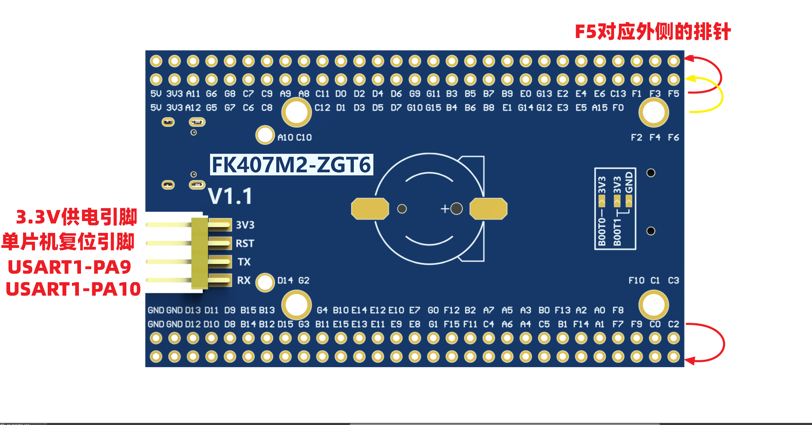
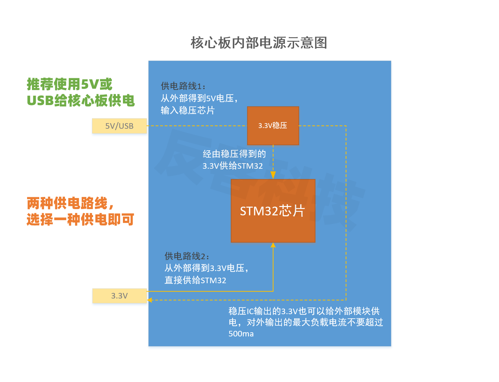

# STM32F4 系列开发板寻迹小车仓库
 
> [!NOTE]\
> 本仓库为学习使用，记录学习开发过程，可供参考
## 使用平台
使用淘宝店铺`反客科技`的`F403ZGT6`开发板
ZGT6板子具有`168MHz`主频，处理性能足够应付多数开发需求，而且板子尺寸较小，发热不多，性能比较强。
下面是相应板子的引脚图

> [!WARNING]\
> 供电一定选择5V供电，并且尽量不要使用**USB**供电，很容易炸稳压

- 以上就是简单的对开发板选型说明
